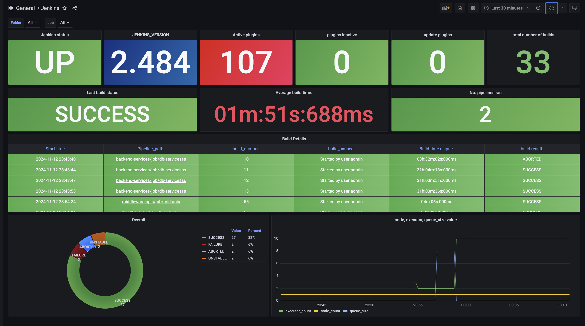
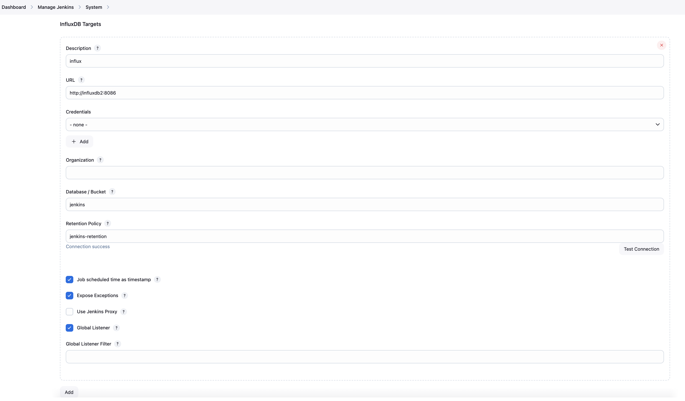
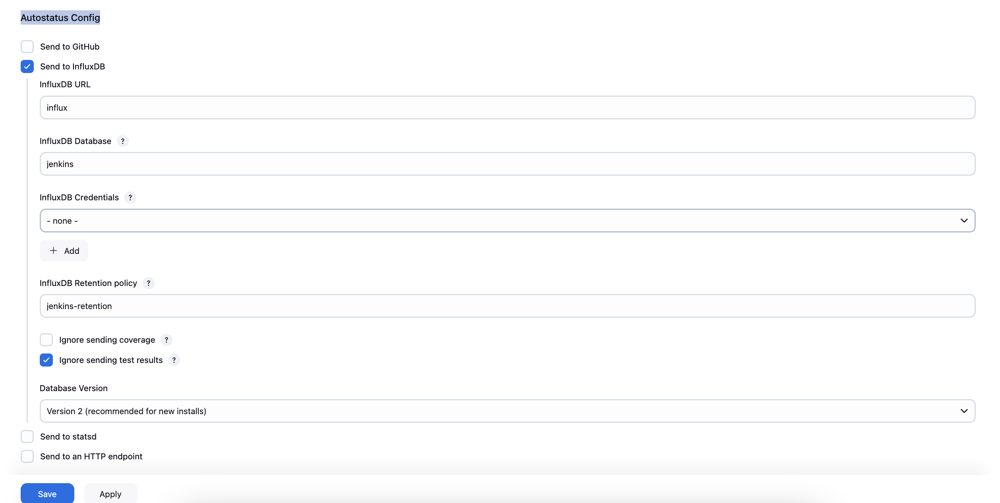
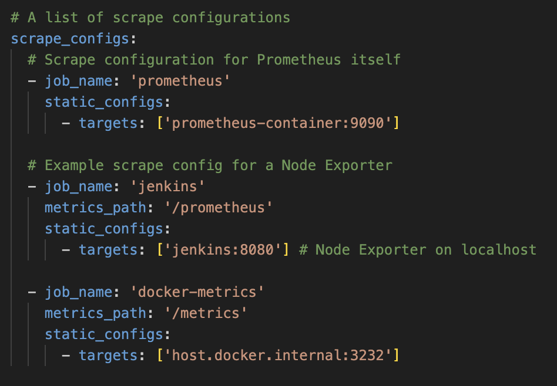
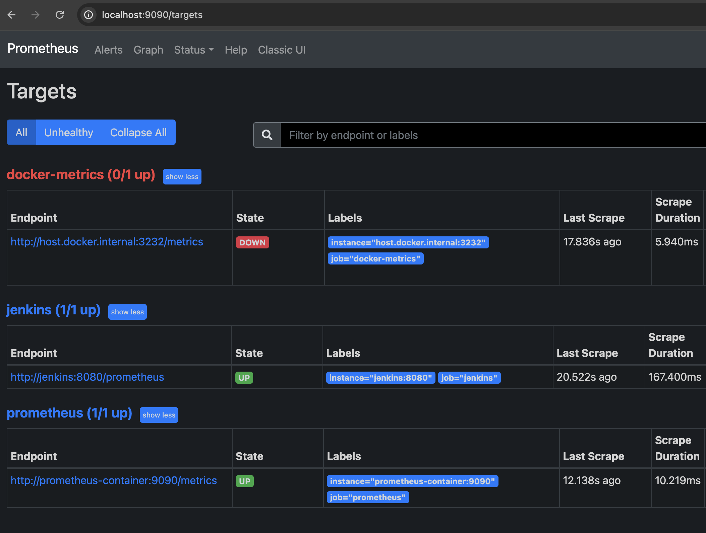
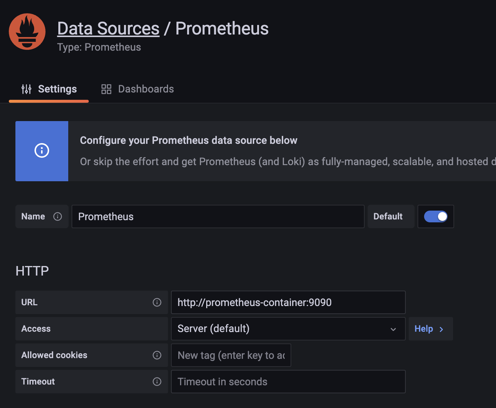
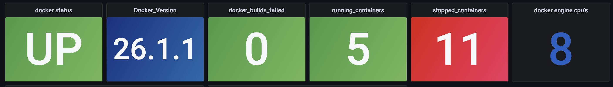

# Monitoring system for CICD (Jenkins)
--------------------------------------
# Jenkins Monitoring

--------------------------------------

This Repo. consists of docker-compose which spins jenkins, prometheus, grafana and influxDB.

#### Jenkins
CICD for building and deploying services
#### Prometheus
To scrape metrics from jenkins on `/prometheus` endpoint.
#### InfluxDB
This plugin allows sending build results to InfluxDB.
#### Grafana
To visualize the data on dashboards.

## Installation:
The repo. consists of required files along with docker-compose consists of all required services and grafana dashboard json for jenins and docker dashboards as shown in below screenshots. (once all setup is finished, upload json file to create dashboards in grafana and do necessary target configurations for jenkins, ignore docker monitoring in this setup)

### step-1:
Up the docker compose `docker-compose up` to spin up the required services. jenkins will be up on `localhost:8080` , grafana on `localhost:3000` , prometheus on `localhost:9090` (replace localhost with you server IP address incase if you run this on other public servers).
### step-2: 
After setting up the jenkins, install `prometheus`, `job and stage monitoring` and `influxDB` plugins in jenkins under plugins tab.

Create a db named jenkins in influxDB, to store job metrics which is injected by jenkins.
` docker exec -it influxdb2 bash` and enter `influx`
then create db - 

`create database "jenkins" with duration 325d replication 1 name "jenkins-retention"`
then `show databases` which should show created db. (Refer screenshot)

Once plugins are installed, under manage/configure tab, select influxDB targets and provide details as mentioned in below screenshot. and similarly for Autostatus Config.

and similarly configure Autostatus config to send all job details and click save:

Since we're running on docker-compose, all host urls will be the container names instead of `localhost`

here the difference between prometheus and influxDB metrics are, where prometheus scrapes metrics about the jenkins server metrics such as cpu, memory etc and jobs metrics like job counts etc. you can view on /prometheus endpoint (`localhost:8080/prometheus`)
[!prometheus-endpoint](assets/promethues-ep.png)

Using influxDB is for detailed metrics about jobs details, timestamp and stage details and more. Detailed metrics are injected to influxDb where we configured it under manage tab. (screenshot).

### step 3:
After completion of db and source configuration setup in jenkins, required to add targets in prometheus.
- enter into prometheus container, we've mounted promethues yaml file under /etc/prometheus/prometheus.yaml, edit the file and add job and target config as mentioned in below screenshot.

- Restart prometheus container once added the configuration and then you should be able to see targets up in prometheus under tarrget section. (refer screenshot).

and finally the targets should be shown as up in prometheus.

Now we're set!!!

- Promtheus plugin will scrape metrics for jenkins server and jobs 
- influxDB will have metrics about detailed jobs and pipeline stages
- now we need to use this 2 sources in grafana to build the clean dashboards for visulazation.
### step 4:
In grafana by using promQL queries, selected metrics can be views and constructed in dashboards.
- you can use `grafana-jenkins.json` file, upload it to create dashboard and do necessary datasource mapping for data fetching.

Final view can be seen as:
(Ignore docker monitoring)
# Jenkins Monitoring

--------------------------------------

# Docker Monitoring

--------------------------------------

That's all 🤘

